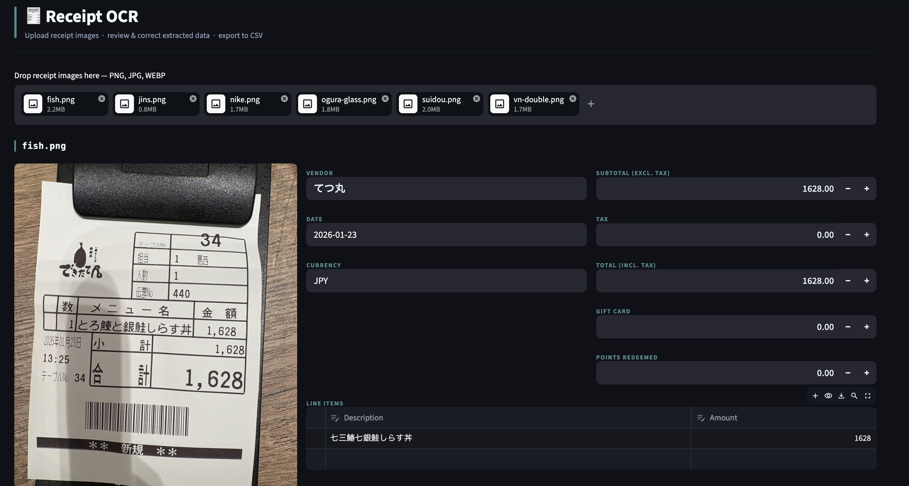

# 🧾 Receipt OCR

A Streamlit app that extracts structured data from receipt images using a vision LLM, designed for Japanese receipts (also works on English and Vietnamese).

Built as a learning side project to help a friend extract receipt data at work and input it into an accounting system.

## Motivation

This started as a practical favour — a friend was manually transcribing Japanese receipts into a spreadsheet at work, which felt like exactly the kind of task a vision model should be able to handle.

The interesting part wasn't any single piece of it. Vision LLMs, structured JSON output, and Streamlit have all matured to the point where each one is straightforward on its own. What was genuinely surprising was how quickly they composed together into something useful. A working prototype — with Japanese OCR, editable review UI, and CSV export — came together in a single two-hour session.

It's a good reminder that the gap between "I know these tools exist" and "I can combine them to solve a real problem" is much smaller now than it used to be.

---

## What it does

1. Upload one or more receipt images (PNG, JPG, WEBP)
2. A vision model extracts structured fields automatically
3. Review and correct the extracted data in the UI
4. Export everything to CSV

**Extracted fields:** vendor, date, currency, subtotal (excl. tax), tax, total (incl. tax), gift card amount, points redeemed, line items



---

## Tech stack

| Layer | Choice |
|---|---|
| UI | Streamlit |
| Vision model | Qwen2.5-VL-72B-Instruct via [OpenRouter](https://openrouter.ai) |
| Language | Python 3.10+ |

The model runs on OpenRouter's infrastructure — no local GPU required. Inference takes ~6–12 seconds per receipt.

---

## Setup

**1. Clone and create a virtual environment**
```bash
git clone https://github.com/your-username/receipt-ai.git
cd receipt-ai
python -m venv venv
source venv/bin/activate      # Windows: venv\Scripts\activate
```

**2. Install dependencies**
```bash
pip install -r requirements.txt
```

**3. Set your API key**

Create a free account at [openrouter.ai](https://openrouter.ai), generate an API key, then:
```bash
cp .env.example .env
# edit .env and paste your key
```

**4. Run**
```bash
streamlit run app.py
```

Opens at `http://localhost:8501`.

---

## CLI usage

You can also run extraction directly without the UI:
```bash
python main.py data/input/your-receipt.jpg
```

Prints extracted JSON to stdout.

---

## Accuracy notes

OCR accuracy on Japanese thermal paper receipts is good but not perfect:

- Vendor names and totals are usually correct
- Line item descriptions on receipts with stylized or compressed fonts can be slightly off
- Tax/subtotal split is calculated in code when the receipt only prints the tax-inclusive total

**The UI is intentionally designed for human review and correction before export.** Treat the extracted data as a first draft.

---

## Privacy

> ⚠️ Receipt images are sent as base64 to OpenRouter's API and processed by Qwen model servers outside Japan. Receipt data leaves your device.

This is acceptable for a personal prototype but may not be suitable for handling sensitive or confidential business receipts.

**Phase 2 will add a local [Ollama](https://ollama.com) backend** to keep all processing on-device.

---

## Roadmap

- [x] Phase 1 — Core extraction (`main.py`) + Streamlit UI + CSV export
- [ ] Phase 2 — Local Ollama backend for on-device privacy
- [ ] Phase 3 — Direct integration with accounting system (TBD)

---

## Project structure

```
receipt-ai/
├── app.py              # Streamlit UI
├── main.py             # Extraction logic (vision API + validation)
├── requirements.txt
├── .env.example
├── .streamlit/
│   └── config.toml     # Disables usage stats prompt
└── data/
    ├── input/          # Drop receipt images here (git-ignored)
    └── output/         # Exported CSVs land here (git-ignored)
```

---

## License

MIT
